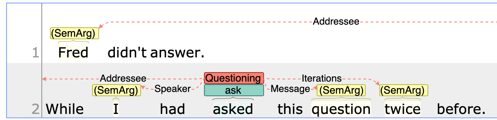

This project provides a short introduction to modeling frame-like annotation tasks such as 
semantic role labeling or event annotation.

The two layers `SemPred` and `SemArg` are used to model the frame. First, a `SemPred` annotation is
created on the words that trigger the frame. The arguments of the frame can then be linked up to
this `SemPred` annotation by creating `SemArg` annotations on the words representing the arguments
and linking them into the `arguments` feature of the `SemPred` annotation.

To facilitate the annotation, the project includes a small set of constraint rules. There are two
types of rules. The first type controls the `category` feature of the `SemPred` annotation based
on the lemma of the trigger word. The second type of rules controls the slots of the `arguments`
feature of the `SemPred` layer. To allow the constraints to work, the `category` and `arguments`
feature have each been associated with a tagset.
