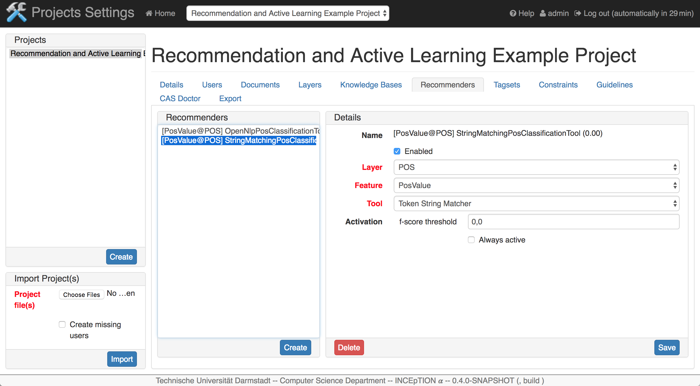
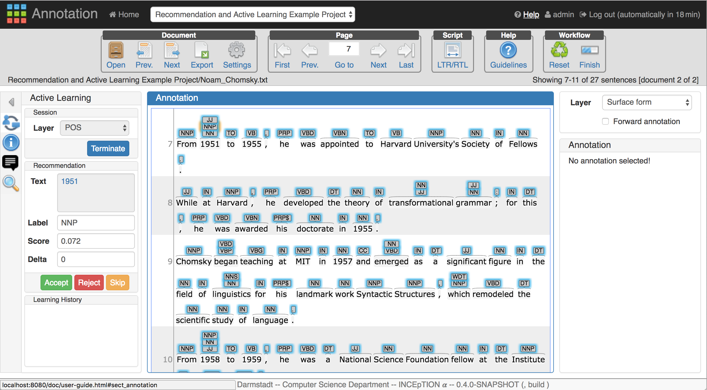

This project is an example for using the recommendation and active learning functionalities of 
INCEpTION to annotate the part-of-speech tags.

There are two documents in this example project:

* __GUM_interview_chomsky.tsv__: it is a well-annotated document chosen from the [GUM Corpus](https://corpling.uis.georgetown.edu/gum/index.html#annos)
* __Noam_Chomsky.txt__: it is a part of the Wikipedia article [Noam Chomsky](https://en.wikipedia.org/wiki/Noam_Chomsky)

Two following recommenders are configured in this project to give suggestions of layer POS:

* Token String Matcher
* Token Sequence Classifier(OpenNLP POS)

After importing the project, this project appears in _Projects_. A user can click on this 
project, then switch to _Documents_ to view the uploaded documents, and switch to _Recommenders_ 
to view the configured two recommenders:

After that, a user can switch to the annotation page and open the document **Noam_Chomsky.txt**. 
The recommendations are shown above the tokens. A user can find the detailed description for 
using active learning to do the annotations in the INCEpTION User Guide. By clicking _Help_, a 
user can view this user guide.

