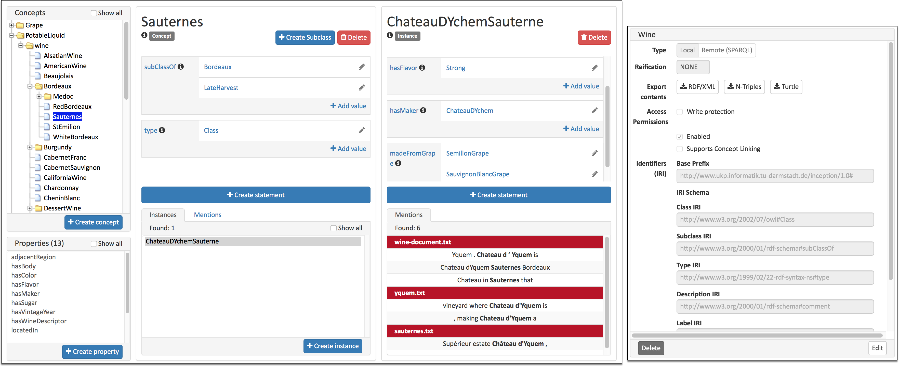
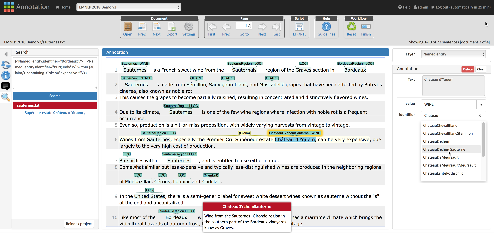

This project is an example for using the search functionalities of 
INCEpTION in order to search for raw text, conventional and knowledge base linked annotations.

In this project, we use a local knowledge base containing the wine ontology from the 
[W3C’s OWL Web Ontology Language Guide](https://www.w3.org/TR/owl-guide), a popular example 
of an OWL-based ontology. 

In this project, we give a brief introduction of how to set up a knowledge base and its related configuration.

## Knowledge Base

The knowledge base (KB) module of INCEpTION enables the user to create a KB from scratch or to import it from an RDF file. Alternatively, the user can connect to a remote KB using SPARQL. However, editing the content of remote KBs is currently not supported. The knowledge base enables the user to annotate the text with entities from KB. 

This section briefly describes how to set up a KB in the KB management page on Projects Settings, explains the functionalities provided by the __Knowledge Base__ page and covers the __concept__ and  __property__ feature types. 


## Project structure and configuration 

After importing the project, it will appear as __Search Example__ in _Projects_. The user can click 
on this project, then switch to the _Documents_ tab to view the uploaded documents:

* __closvougeot.tsv__: A text about Clos de Vougeot wines.
* __sauternes.tsv__: A text about Sauternes wines.
* __wine-document.tsv__: A text about Chateau d'Yquem wines.
* __yquem.tsv__: Another text about Chateau d'Yquem wines.


### Knowledge base configuration

Switching to the _Knowledge bases_ tab will show the configuration of the knowledge base. 
It has been previously created and imported using the RDF file available 
[here](https://www.w3.org/TR/owl-guide/wine.rdf).

### Knowledge Base scope setting for feature layer

In the __Projects Settings__, switch to the __Layers__ tab where the user can edit the configuration 
for the pre-defined layers or create a new layer clicking the __Create__ button on the bottom of the panel. 
The user can define several features for each of the layers as shown in the figure below.


The feature configuration needs a name along with the __Type__ which sets the primary scope of the feature. The dropdown provides the user with one of the option as __KB: Concept/Instance__, which sets the scope of the feature to knowledge base entities. 

Furthermore, this feature which has been configured, if set to __KB: Concept/Instance__, asks for the __Allowed values__ which has three values as options: __Any Concept/Instance__, __Only Concept__ and __Only Instance__. When the user annotates the text with the particular layer for this feature which has been configures for __Any Concept/Instance__ , the auto complete field lists all the concept and instances, while for __Only Concept__ and __Only Instance__ it list only concept or only instance respectively.

The feature configuration allows her to set up the configuration to list the values from a specific knowledge base. The __Scope__ field allows her to set the scope of KB entities with a specific concept limiting the annotation values to sub class and instances of the concept defined as scope. In case the user selects __Any Concept/Instance__, the values will be instances of the specified concept and the child concepts (which includes the hierarchy of child concepts) including their instances, of the specified concept in the __Scope__. Likewise, the choice of __Only Concept__ limit the values to the child concepts (which includes the hierarchy of child concepts) and  __Only Instance__ limit the values to all of the instances and the instances for the child concepts of the specified concept. 

### Custom layers and features

Switching to the _Layers_ tab will show the configuration of the layers for the example project.
Besides the built-in layers, the project has the following custom annotation type:

* _Claim_: used to annotate statements made about a given wine.

Furthermore, two additional tags have been added to the __value__ feature of the __Named Entity__
 annotation type: 

* _WINE_: a named entity representing a certain wine
* _GRAPE_: a named entity representing a certain grape

Named entities can be linked to the knowledge base through the __identifier__ feature. Thus, a 
given wine annotation can be directly linked to the corresponding _Wine_ 
concept (or subconcepts), or a grape annotation can be linked to the _Grape_
concept in the knowledge base.


### Knowledge base contents

The knowledge base contents can be viewed in the _Knowledge Base_ page, accessible from the 
main menu. There, the user can see the whole ontology in a tree-like structure.



## Doing searches in the project

For searching over the annotations (and also creating new annotations or updating the existing ones
if needed), a user must first switch to the annotation page and open any of the project documents. 
The annotations contained in the document will be shown in the central main editor, just 
above the tokens.

For searching, the user must open the search sidebar clicking on the magnifier button in the left. 
In the search sidebar, the user can write queries for retrieving text passages containing specific 
words (tokens), annotations like named entities, or annotations linked to the knowledge base.

Use the __Search__ button to execute a query. The results will appear just below, grouped by
document. Clicking on a result will automatically show it in the central edit window. 



INCEpTION indexing and search mechanism uses 
[MTAS](https://meertensinstituut.github.io/mtas/index.html), an indexing framework that 
implements a large part of the CQL (Corpus Query Language) language on top of Apache Lucene. 
CQL is a language for querying documents, introduced by the IMS Open Corpus Workbench (IMS CWB), 
a powerful tool to index and search annotated corpora.

Below are some example CQL queries that show some of the search capabilities of INCEpTION:

### Queries over the raw text (tokens) and conventional annotations

* All occurrences of the token _Bordeaux_

```
Bordeaux
```

* All occurrences of named entities of type _LOCATION_

```
<Named_entity.value="LOC"/>
```

* All occurrences of named entities of type _WINE_

```
<Named_entity.value="WINE"/>
```

* All occurrences of named entities regardless of their types


```
<Named_entity/>
```

### Queries over annotations linked to knowledge base concepts

* All mentions of wines under the _Bordeaux_ branch of the wine ontology

```
<Named_entity.identifier="Bordeaux"/>
```

* Appending `-exact` to the identifier field will limit the above query to only mentions directly 
linked to the _Bordeaux_ branch of the ontology. No mentions linked to the _Bordeaux_ subtypes
will be retrieved:


```
<Named_entity.identifier-exact="Bordeaux"/>
```

* A query can also directly refer the concept URI instead of its label. For retrieving all
 exact mentions of the _Clos de Vougeot_ wine:

```
<Named_entity.identifier-exact =
"http://www.w3.org/TR/2003/PR-owl-guide-20031209/wine#ClosDeVougeotCotesDOr"/>
```

### Complex queries

* Queries can be combined using operators such as within or containing. For retrieving all mentions 
of wines belonging to the _Burgundy_ or _Bordeaux_ types (and their subtypes), located 
inside a claim that matches the regular expression pattern __expensive.*__

```
(<Named_entity.identifier="Burgundy"/> | <Named_entity.identifier="Bordeaux"/>)
within (<Claim/> containing "delicious.*")
```

### To learn more

To learn more about MTAS implementation of CQP and its syntax, 
access [this link](https://meertensinstituut.github.io/mtas/search_cql.html).

