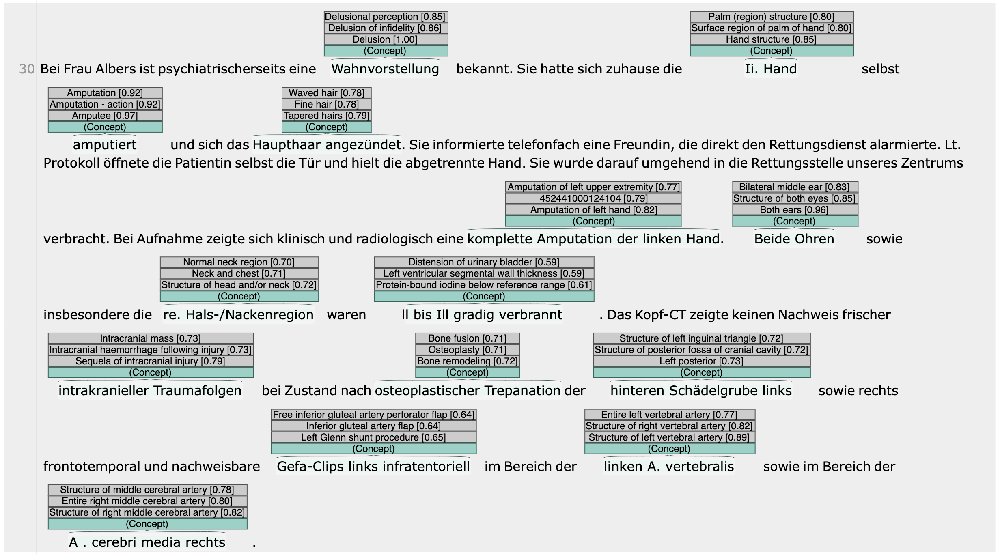

[xMEN][1] is an extensible toolkit for Cross-lingual (x) Medical Entity Normalization. 
It can be used as a [recommender][2] in INCEpTION.

You can set this up in three easy steps:

1. Download and import the example project on this page

2. Download the pre-computed xMEN index for SNOMED CT (Germany) per the [instructions][2] and extract it to the current directory.

3. Run the xMEN recommender docker image: `docker run -m=12g -p 5555:5000 -v "$(pwd)"/xmen_index/index:/index/ ghcr.io/hpi-dhc/xmen-inception-recommender:main` 

Once everything is running, you can access the annotation page. 
When you create an annotation by marking a medical term in the text using the mouse, the recommender will spring into action and suggest a SNOMED-CT concept to link to the term.
If you import the SNOMED-CT terminology into the project, it will be used to resolve the concepts to their human readable names.
Otherwise, the terms will be shown as their SNOMED-CT concept IDs.

[1]: https://github.com/hpi-dhc/xmen
[2]: https://github.com/hpi-dhc/xmen-inception-recommender