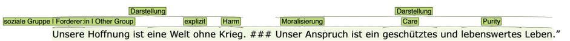

**Source**: <i>This example was kindly contributed by <a href="https://www.gs.uni-heidelberg.de/sprache02/mitarbeiter/becker.html">Maria Becker</a>, Germanistisches Seminar, Universität Heidelberg, Germany</i>

In the project [Annotation and Analysis of Moralization Practices][1], we create a dataset with texts from different knowledge domains in which practices of moralization are annotated.
By moralizing practices we mean strategies in which moral values are utilized for describing issues and the required actions. Vocabulary that refers to moral values (such as *"freedom"*, *"security"* or *"credibility"*) is used to enforce a demand that in this way appears inescapable and requires no further explanation or justification, as in the following sentence, in which the word *"security"* is used to support a demand for a cap for refugees: *"We should introduce an upper limit for refugees to ensure the security of German citizens."*

  

Within the project, corpora with instances of moralization practices from different domains of knowledge, text types, cultures and languages are created and annotated with (linguistic) features that are characteristic for moralizing practices. These annotation categories include:

* Moral values, as categorized by the Moral Foundations Theory (Haidt et al., 2012) (e.g. care vs. harm, fairness vs. cheating…)
* The roles and group affiliations of the protagonists
* The communicative function of the utterance (according to Jakobson, 1979)
* The explicitness or implicitness of the demand accompanying the moralization.

The resulting data set will be used in the future for automated detection and analysis of moralization practices - a diffuse concept that is to be operationalized as a term in descriptive linguistics.

[1]: https://www.uni-heidelberg.de/en/research/research-profile/fields-of-focus/field-of-focus-iii/research-activities/annotation-of-moralizing-practices
