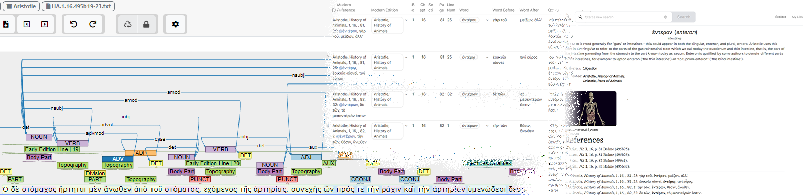

**Source**: <i>This use-case was kindly contributed by <a href="https://www.linkedin.com/in/premshay/">Premshay Hermon</a>, product manager of the Atlomy project at the Hebrew University of Jerusalem, Israel</i>

[ATLOMY][project-website] is an interdisciplinary project for the study of the history of anatomy. The results of the project are accessible through the [ATLOMY interactive atlas][interactive-atlas].
Funded by the European Research Council (ERC), the project sets out to devise new data-oriented tools to analyze and visualize ancient medical writings. It focuses on the study of Greco-Roman anatomy, which is the foundation of modern Western anatomical knowledge.
The interdisciplinary team is composed of historians of science, classicists, modern anatomists and surgeons, 3D modelers, product experts and data scientists, jointly deciphering and mapping the anatomical ideas and terminology in the ancient texts and developing innovative high-end outcomes to make it available to modern researchers by interactive scholarly means which are tailored to their needs.

ATLOMY uses the INCEpTION annotation platform to train custom models within the popular natural language processing library, spaCy. By manually annotating a large dataset of ancient texts within INCEpTION, ATLOMY is able to create a high-quality training dataset that is specifically tailored to their domain of study. Once the annotated dataset is imported into spaCy, the custom models can be trained to accurately identify and extract named entities and other important information from the texts. This allows ATLOMY to more effectively analyze the ancient texts and gain insights into the ideas and terminology used in the ancient world. Overall, the use of INCEpTION to train models within spaCy greatly enhances the capabilities of ATLOMY's research. Additionally, the platform's flexibility allows ATLOMY to efficiently and effectively extract information needed for the complex references database powering the research and the main output - an online interactive atlas and lexicon.

The following passage details the process for each use:

1. **Machine-assisted text analysis:** The project revolves around defining anatomical terms and
procedures in ancient times. Analysis of each text starts with highlighting and classifying words of interest (body parts, tools, medical words,etc.), followed by an analysis of its role in the sentence and its relations with other words. This is known as *Named Entity Recognition* (NER), a type of information extraction task in NLP. The amount and the diversity of texts suggest that a machine may be better suited to perform this task. Automating it, however, requires carefully building a dataset and retraining (fine-tuning) the ML model. INCEpTION makes this process feasible, thanks to several features: custom layers, curation and external recommenders. 
First, the annotators label the words of interest, using a custom layer with a tagset of category types.
A curator reviews the finished document and amends the classification, if needed.
The finished documents are added to a dataset used for the language model training.
The trained language model is uploaded to a recommender server.
When a new document is opened in INCEpTION, it connects to the recommender server, submits the document for analysis and finally shows recommendations on classification for words in the document. The annotators confirm, edit and add annotations.
This iterative process accelerates the human annotation process, but it also allows testing of the model in a live environment.
The same process is used for other NLP tasks, such as lemmatization, part-of-speech tagging and dependency parsing, using INCEpTION's built-in layers and customizing when needed.
2. **Bibliography annotation:** ATLOMY utilizes INCEpTION's custom layers and metadata features to tag bibliographical details. These details include everything needed for a full academic reference of primary sources, from book name to line number. The finished documents are processed (using a Python script) and added to the ATLOMY databases.
This workflow saves both time and effort for the entire team: labeling reference details is quicker than manually writing a full reference, especially when having thousands of references with links between them. It also reduces the chance of errors in referencing.
As texts are further analyzed and labeled, it is easily added to the database, enriching each word with additional information such as dependent words, quotes, adjacent words, and more - all are important data points used in the online atlas, as well as in the research itself.

The [online atlas and lexicon][interactive-atlas] are used by researchers around the world to learn more about anatomy in the ancient texts. The atlas provides visual 3D interactive recreations of the anatomies, as well as a full textual analysis and references. The ancient medical world comes alive in this new, data-based approach to classical research. ATLOMY strives to make the digital tools accessible for all researchers. INCEpTION is a part of what makes such a project possible.

[project-website]: https://atlomy.huji.ac.il/
[interactive-atlas]: https://www.atlomy.com/
