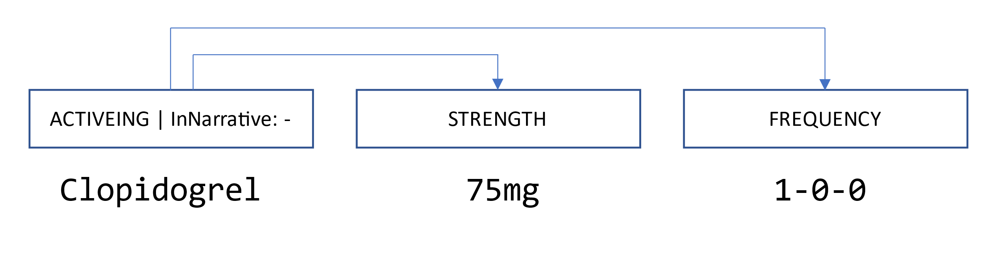

**Source**: <i>This use-case was kindly contributed by <a href="https://www.cl.uni-heidelberg.de/nlpgroup/person/richter-pechanski">Phillip Richter-Pechanski</a>, Heidelberg University Hospital (DieterichLab), Germany</i>

CARDIO:DE is the first freely available and distributable large German clinical routine corpus from the cardiovascular domain. CARDIO:DE encompasses 500 clinical routine German doctor’s letters from Heidelberg University Hospital, which were manually annotated. The prospective study design complies well with current data protection regulations and allows us to keep the original structure of clinical documents consistent. In order to ease access to the corpus, all letters were manually de-identified. To enable various information extraction tasks the temporal information in the documents was preserved. The complete corpus contains 993,143 tokens, with approximately 31,952 unique tokens.

CARDIO:DE includes two high-quality manual annotation layers: 

1. **Medication information**: The medication information annotation scheme is based on Uzuner et al, 2010, and was adapted to the specific structure of our CARDIO:DE data. The annotation objective was to identify a relevant drug (`Drug`) or active ingredient (`ActiveIng`) and its relation information (`Dosage`, `Route`, `Frequency`, `Duration`, `Strength`, `Reason` and `Form`). Moreover, we added a binary attribute (inNarrative) to each Drug/ActiveIng, to mark whether the medication information is in a semi-structured or in a plain text section. The final CARDIO:DE corpus contains in total 26,576 annotated medication information entities with 15,105 medication relations.

2. **2. CDA-compliant section classes**: The Section type annotation scheme is based on Lohr et al, 2018 31, but is more coarse-grained and carried out on paragraph-level. Fourteen section types were annotated: `Anrede`, `AktuellDiagnosen`, `Diagnosen`, `AllergienUnverträglichkeitenRisiken`, `Anamnese`, `AufnahmeMedikation`, `KUBefunde`, `Befunde`, `EchoBefunde`, `Labor`, `Zusammenfassung`, `Mix`, `EntlassMedikation`, `Abschluss`. Nine section types are mapped to HL7 CDA elements ([[Arztbrief Plus, v. 3.15](https://wiki.hl7.de/index.php?title=IG:Arztbrief_Plus)], accessed 06.10.2022). The final corpus contains in total 116,898 annotated paragraphs with section classes.

We used INCEpTION (v22.3) for all annotation projects. In addition, we used the tool to support manual de-identification of all letters using a pre-defined set of PHI classes, such as person, location and date.

All annotations were conducted using well-established annotation methods, including a guideline adaptation process by redundantly annotating documents by multiple annotators involving an inter-annotator agreement score (IAA) in an iterative approach  (Roberts et al, 2009).

The corpus must be formally requested following instructions on the CARDIO:DE website in the [[Terms of Use section](https://doi.org/10.11588/data/AFYQDY)].

The following features of INCEpTION were used:
* Custom entity layers and tag sets
* Custom entity relation definitions
* Multi-user document assignment
* Batch document import and export
* Curation and monitoring tools during annotation projects
* Custom projects per annotation layer
* PDF guideline integration

##### References
* Richter-Pechanski, Phillip, et al.:
  A distributable German clinical corpus containing cardiovascular clinical routine doctor’s letters.
  In: Scientific Data 10.1 (2023): 207.
  [[online](https://www.nature.com/articles/s41597-023-02128-9)]
