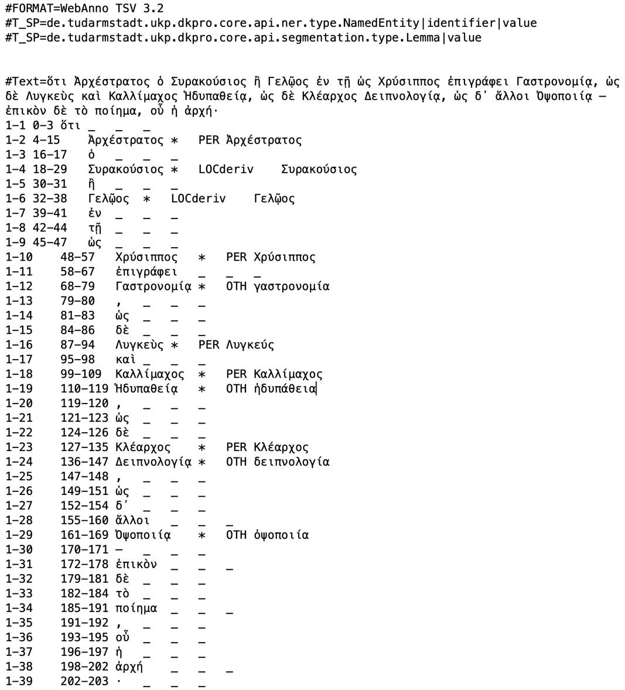
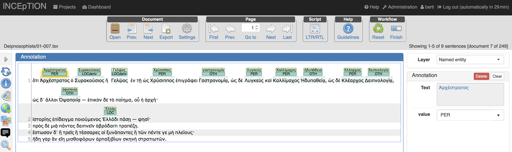
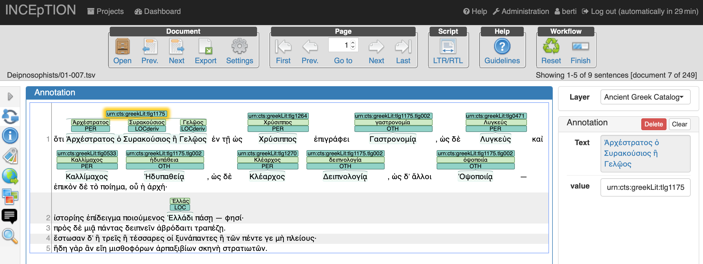

**Source**: *This use-case was kindly contributed by [Monica Berti](http://www.monicaberti.com), Department of Digital Humanities,
Universität Leipzig, Germany.*

The [Digital Athenaeus project](<http://www.digitalathenaeus.org>)  is
focused on annotating quotations and text reuses in the Greek text of
the *Deipnosophists* of Athenaeus of Naucratis (2nd-3rd century CE). The
goal is to provide an inventory of authors and works cited by Athenaeus
and implement a data model for identifying, analyzing, and citing
uniquely instances of text reuse in ancient Greek literature.

<a href="https://videolectures.net/videos/clarinannualconference2019_berti_named_entity">

 Named Entity Annotation for Ancient Greek with INCEpTION
 talk by Monica Berti recorded at the CLARIN Annual Conference 2019
</a>

INCEpTION is used by the Digital Athenaeus project to extract and
annotate named entities in the Greek text of the *Deipnosophists*, which
is a rich collection of proper names pertaining to a wide variety of
typologies like personal names, peoples, places, groups, languages,
festivals, astronomical and meteorological phenomena, chronological data
and currencies. Athenaeus’ work is also a huge mine of references to
more than 900 authors of Classical literature and their writings.

NER has been performed semi-automatically on the text of the Teubner
edition of the *Deipnosophists* by Georg Kaibel, which contains 264,750
tokens distributed in 15 books for a total of 1,328 paragraphs and
21,460 sentences. The result is the extraction of ca. 23,000 inflected
forms of single named entities corresponding to more than 8,000 unique
forms and more than 4,400 lemmata. Lemmata have been used to query
external authority lists to disambiguate annotations. Data is stored in
an SQL database, whose entries can be publicly interrogated in the
[Named Entities Digger](<http://www.digitalathenaeus.org/tools/KaibelText/named_entities_digger.php>)
and in the [Named Entities Concordance](<http://www.digitalathenaeus.org/tools/KaibelText/named_entities_concordance.php>)
of the **Digital Athenaeus** project.

INCEpTION is currently used to visualize, correct, and nest annotations
of single ancient Greek named entities that have been semi-automatically
extracted. Data has been imported into INCEpTION as TSV files generated
according to the WebAnno TSV 3.2 file format. Each file includes the
text of single paragraphs of the *Deipnosophists* with sentences split
in separate lines. <a href="#figure1">Figure 1</a> shows an example of a TSV file with
annotated named entities and corresponding lemmata (Ath., *Deipn*. 1.7):

<figure id="figure1">
  
  <figcaption>Figure 1. TSV 3.2 file format (NEs and lemmata in Ath., Deipn. 1.7)</figcaption>
</figure>

<a href="#figure2">Figure 2</a> shows how pre-annotated data is visualized in INCEpTION in
separate numbered lines. Single entities are annotated with two layers:
one for the named entity tag, and the other for the lemma (Ath.,
*Deipn*. 1.7):

<figure id="figure2">
  
  <figcaption>Figure 2. INCEpTION: pre-annotated data (Ath., Deipn. 1.7)</figcaption>
</figure>

A layer called *Ancient Greek Catalog* has been created in INCEpTION to
annotate named entities of the *Deipnosophists* that correspond to names
of ancient authors and to descriptions/titles of ancient works. The
reason for this layer is to disambiguate names of ancient authors and
titles of works in order to produce a text-based catalog of Greek
literature with annotations of ancient Greek inflected forms and their
corresponding lemmata.

<a href="#figure3">Figure 3</a> shows the same paragraph of figures 
<a href="#figure1">1</a> and <a href="#figure2">2</a> with the *Ancient
Greek Catalog* layer, whose values correspond to CTS URNS that uniquely
identify authors and works. Also, individual entities have been linked
together in spans corresponding to real entities, as for example
Ἀρχέστρατος ὁ Συρακούσιος ἣ Γελῷος (Archestratus from Gela or Syracuse),
who is identified as [urn:cts:greekLit:tlg1175](http://catalog.perseus.org/catalog/urn:cts:greekLit:tlg1175). In the same line,
different forms of the title of Archestratus’ work are identified with a
CTS URN that also includes a reference to the author:
*urn:cts:greekLit:tlg1175.tlg0020*.

<figure id="figure3">
  
  <figcaption>Figure 3. INCEpTION: Ancient Greek Catalog layer (Ath., Deipn. 1.7)</figcaption>
</figure>

Future work will include complete NEs disambiguation and linking, and
coreference resolution with a focus on entities related to ancient Greek
authors and works.

The final goal is to use INCEpTION for linking entity mentions to
knowledge bases and structured vocabularies for ancient Greek authors
and works that will enable scholars to annotate other texts and generate
a text-based catalog of ancient Greek literature.
