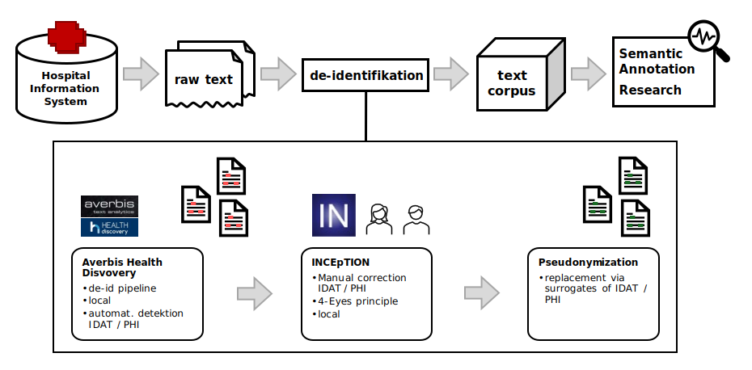

**Source**: <i>This example was kindly contributed by 
<a href="https://www.informatik.tu-darmstadt.de/ukp/ukp_home/staff_ukp/detailseite_mitarbeiter_1_41920.en.jsp">Christina Lohr</a>,
 Institute for Medical Informatics, Statistics and Epidemiology of University Leipzig, Germany</i>

In everyday clinical practice, numerous texts are generated, such as doctors' letters and reports, which contain valuable information about the progression, development, and treatment of diseases. These texts could be leveraged by natural language processing (NLP) tools to support healthcare professionals and researchers. However, the full potential of these clinical documents remains untapped due to a lack of standardization. The [GeMTeX (German Medical Text Corpus)][1] platform aims to bridge this gap by making medical texts from patient care available for research projects. The goal is to create ob of the largest corpus of medical texts in the German language.

Through the GeMTeX project, six university medical centers in Munich, Leipzig, Essen, Berlin, Dresden, and Erlangen are collecting documents from electronic patient records (ePA) with patient consent. These documents are annotated using the INCEpTION annotation platform. Using NLP techniques, the documents are processed in compliance with data protection regulations and made available in anonymized form for shared research use. This effort creates a valuable text corpus for research and development.

The initial phase of the project focuses on de-identification—a process that obscures information that could reveal personal identities. To facilitate this, medical students from the universities of Leipzig and Erlangen, along with a team of experts in linguistics, medicine, and informatics, conducted a pilot study. They created 1,438 annotations on simulated doctors' letters from the Graz Synthetic Text Corpus (GRASCCO).

The annotated documents were published on the international research data platform [Zenodo][3], serving as a model for future projects. Alongside the annotated corpus, a publication was released that describes the process for de-identifying medical documents. This "de-identification pipeline" includes the following steps:

* Exporting clinical texts as raw data from the local hospital information system
* Importing the data into the INCEpTION annotation platform
* Automated preliminary annotation of text segments with personally identifiable information using the Averbis Health Discovery Pipeline
* Manual review and correction of annotations through a two-person verification process
* Automated replacement of pre-annotated and corrected data with appropriate pseudonyms

<figure id="figure2">
  
  <figcaption>Figure 1. Processing and annotation workflow</figcaption>
</figure>

The project is currently work in progress. During the further course of the project, INCEpTION will be used to create, correct and curate additional annotations conforming to the [SNOMED-CT][2] terminology.

##### References

* Lohr C, Matthies F, Faller J, et al. 
  De-Identifying GRASCCO - A Pilot Study for the De-Identification of the German Medical Text Project (GeMTeX) Corpus. 
  In: Stud Health Technol Inform. 2024; 317:171-179. 
  [[doi:10.3233/SHTI240853]](https://doi.org/10.3233/shti240853)

* Lohr, C., Matthies, F., Jakob, F., Modersohn, L., Riedel, A., Hahn, U., Kiser, R., Boeker, M., & Meineke, F. (2024). 
  GraSCCo_PHI - Graz Synthetic Clinical text Corpus with Protected Health Information Annotations [Data set]. Zenodo. 
  [https://doi.org/10.5281/zenodo.11502329][3]

[1]: https://www.smith.care/en/gemtex_mii/about-gemtex/
[2]: https://www.snomed.org
[3]: https://zenodo.org/records/11502329
