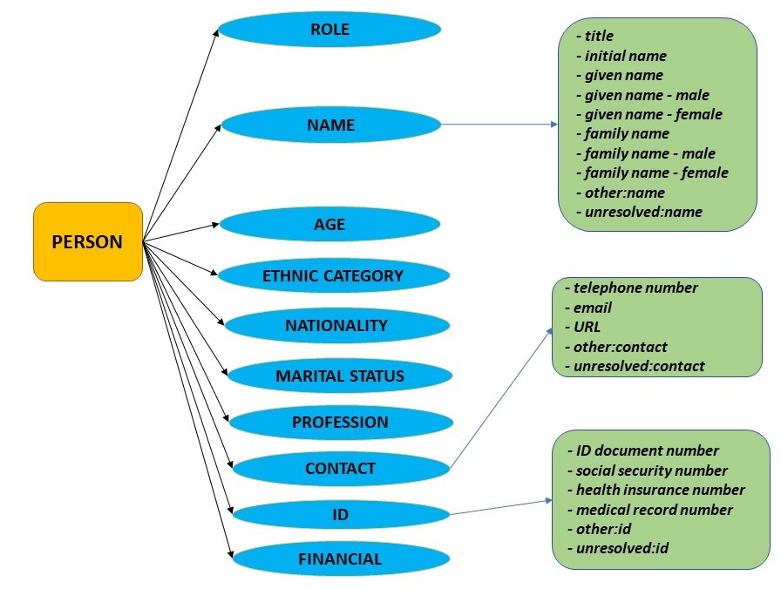
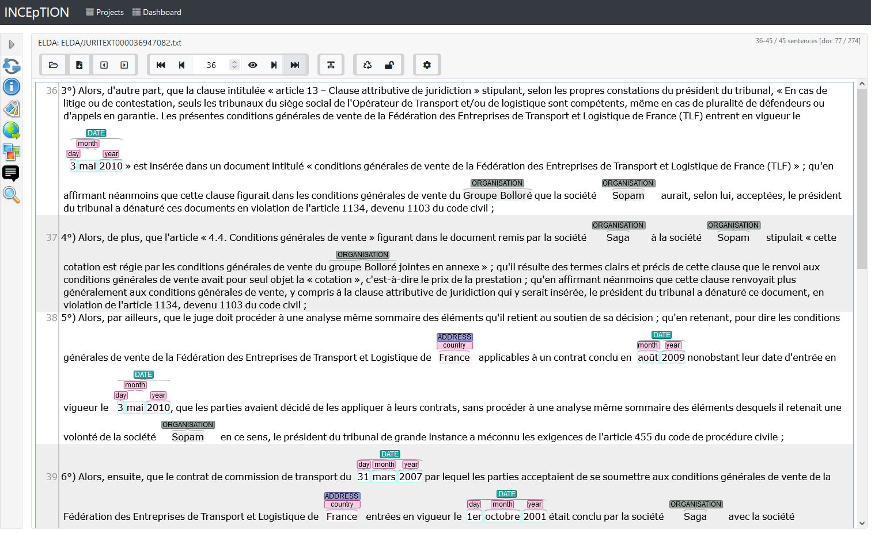

**Source**: <i>This use-case was kindly contributed by Victoria Arranz, Evaluations and Language resources Distribution Agency (ELDA), Paris, France.</i>

The [MAPA (Multilingual Anonymisation for Public Administrations)][1] Project has developed an open-source toolkit for the de-identification (detection and substitution) of sensitive information in the legal and medical domains. The detected sensitive information can be either obfuscated or replaced by other similar entities, the latter rendering the de-identified text useful for further processing and reuse. The toolkit addresses all 24 EU official languages, and it can be accessed as an NLP service under [https://language-tools.ec.europa.eu/][2].

MAPA uses transformer-based Neural Networks (BERT). The sensitive entities detection and classification task is trained on annotated data that the project consortium produced with the INCEpTION platform.

MAPA started by designing a three-level [Named Entity Hierarchy][3] that was later adapted and configured within INCEpTION. This annotation tool allows for a rich and flexible annotation of the data. For instance, an entity may be annotated with elements from any of the three MAPA levels if this is allowed by the annotation schema and these elements have been defined in INCEpTION.

Below follows an excerpt from the MAPA NE hierarchy, which covers information that may be considered as sensitive or personal and that needs to be de-identified within the texts:

<figure id="figure1" style="text-align: center">
  
</figure>

An example of French text annotated with INCEpTION for the legal domain (derived from the French Court of Cassation) is as follows:

<figure id="figure2" style="text-align: center">
  
</figure>

NE annotation with INCEpTION is simple while allowing for complex annotation, done at several levels, with entity linking (if required), and with a wide range of features. It also allows for different types of annotations (e.g., NEs, POS, dependencies, coreferences, etc.), which offers the possibility to annotate data with several linguistics layers.

MAPA created several projects assigning different users to each project which permitted us to split parallel annotations for different languages and domains. Different user profiles can be defined, which allows for a full annotation-project management and follow-up through the platform. 
There is a large variety of annotation features that can be either set-up or configured within the platform together with the definition of the NE hierarchy to be applied. We can make use of tag overlapping (for hierarchy annotation), colour coding to identify tags, setting up hotkeys, as well as define the necessary tag granularity and allow for the crossing of sentence boundaries. All these are very useful.

MAPA used INCEpTION both for annotation from scratch as well as correction of already annotated data. The latter supported an experiment on synthetic data production and another one on automatic pre-annotation. INCEpTION supports a wide selection of well-known formats and importing already annotated data is very straightforward.

MAPA’s annotated datasets for the 24 EU official languages are available as TSV files through the [ELRC-SHARE][4] repository. 

A final but very important feature of INCEpTION is its user support. We would like to add how grateful we are to the INCEpTION project group for their help with the annotation platform and for their eagerness to adapt and improve things for the users.

##### References

* Victoria Arranz, Khalid Choukri, Montse Cuadros, Aitor García Pablos, Lucie Gianola, Cyril Grouin, Manuel Herranz, Patrick Paroubek and Pierre Zweigenbaum (2022). 
  MAPA Project: Ready-to-Go Open-Source Datasets and Deep Learning Technology to Remove Identifying Information from Text Documents.
  In Proceedings of the Language Resources and Evaluation Conference 2022 (LREC 2022), Marseille, France, June 2022. 
  [[PDF](http://www.lrec-conf.org/proceedings/lrec2022/workshops/LEGAL/pdf/2022.legal-1.12.pdf)]

[1]: https://mapa-project.eu/
[2]: https://language-tools.ec.europa.eu/
[3]: http://www.elra.info/media/filer_public/2022/05/10/mapa_annotation-guidelines-v6.pdf
[4]: https://elrc-share.eu/repository/search/?q=MAPA
