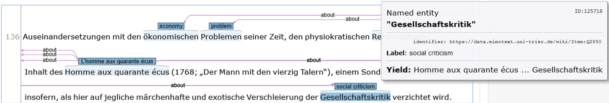
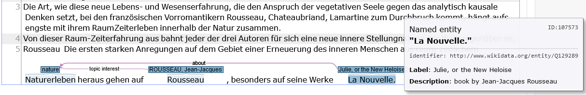

**Source**: <i>This use-case was kindly contributed by Tinghui Duan, Maria Hinzmann, Anne Klee, Johanna Konstanciak, Julia Röttgermann, Christof Schöch and Moritz Steffes, University of Trier, Trier Center for Digital Humanities.</i>

The interdisciplinary project in computational literary studies MiMoText (["Mining and Modeling Text: Interdisciplinary applications, informational development, legal perspectives"][1]) is conducted at the [Trier Center for Digital Humanities (TCDH)][2] at the University of Trier and funded by the Research Initiative (2019–2023) of the federal state of Rhineland-Palatinate (Forschungsinitiative Rheinland-Pfalz).

We are dealing with new ways to model and analyze literary history and literary historiography. The overall aim is to establish a knowledge graph that aggregates statements relevant to literary history extracted from three types of sources: bibliographical reference works, primary texts and scholarly publications. Our application domain is the French novel of the second half of the 18th century.

In this project we use INCEpTION to manually annotate texts from the scholarly works. In a first phase Named Entities like literary works and authors as well as thematic concepts have been annotated and relations have been drawn between them. By connecting Wikidata and our [MiMoTextBase][3] to INCEpTION, we can annotate directly using the knowledge bases. For example the thematic information occurring in the texts can thus be linked to a concept from a [controlled thematic vocabulary][4] which has been developed in the project.

Exported as UIMA CAS we can generate statements from the annotation for feeding them into our MiMoText knowledge graph (see script and documentation on [GitHub][5]).

Features of INCEpTION that we consider of particular importance to our use case are:

* The annotation of spans and relations involving multiple annotation layers
* The ability of defining custom entity layers and relations
* The integration of knowledge bases such as Wikidata as well as our own knowledge base
* Exporting projects as WebAnno TSV and UIMA CAS
* Further processing the exported annotations with [dkpro-cassis][6]

<figure id="figure1">
  
  <figcaption>Figure 1. The thematic concept 'Gesellschaftskritik' is linked to the vocabulary item 'social criticsm' in the MiMoTextBase.</figcaption>
</figure>

<figure id="figure2">
  
  <figcaption>Figure 2. Relation with label 'about' which corresponds to the property P36 in MiMoTextBase.</figcaption>
</figure>

<figure id="figure3">
  
  <figcaption>Figure 3. Linking work titles with Wikidata.</figcaption>
</figure>

A detailed documentation of the project-specific workflow can be found here: https://github.com/MiMoText/inception_themes/blob/main/documentation_inception_workflow.pdf.
For more information and tutorials related to the MiMoTextBase, please refer to the [MiMoTextBase website][7].

##### References
Schöch, Christof, Maria Hinzmann, Röttgermann Julia, Anne Klee, and Katharina Dietz. "Smart Modelling for Literary History." IJHAC: International Journal of Humanities and Arts Computing [Special Issue on Linked Open Data] 16, no. 1 (2022): 78–93. doi: https://doi.org/10.3366/ijhac.2022.0278

[1]: https://www.mimotext.uni-trier.de/en
[2]: https://tcdh.uni-trier.de/en
[3]: https://data.mimotext.uni-trier.de/wiki/Main_Page
[4]: https://github.com/MiMoText/vocabularies/blob/main/thematic_vocabulary.tsv
[5]: https://github.com/MiMoText/inception_themes
[6]: https://github.com/dkpro/dkpro-cassis
[7]: https://docs.mimotext.uni-trier.de

