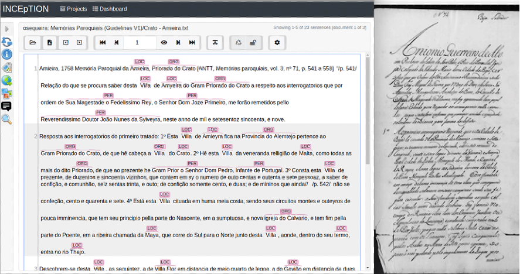

**Source**: <i>This use-case was kindly contributed by Helena Freire Cameron, Fernanda Olival and Renata Vieira from CIDEHUS, University of Évora and VALORIZA, Polytechnics of Portalegre, Portugal.</i>

The Parish Memories are an essential Portuguese historical source that have been manually transcribed to a digital version and is publicly available at [CIDEHUSDigital][1]. This source contains data of a very diverse nature: demographic, religious and artistic (on churches and convents, antiquities on-earth), economic (main productions, mines, resources and fish mills, mills, fairs, ports), medicinal herbs, festivities, etc.  

The texts were automatically annotated for generating an entity data set regarding persons, locations, and organizations. In the resulting published dataset, we provide the tagged texts, the lists of extracted entities, and the frequency counts. The dataset is useful for historians. Its annotation may allow, for instance, comparative analyses between parishes and regions or to calculate the area of influence of a locality. Two researchers annotated a portion of it manually, using the INCEpTION tool, for evaluation purposes. 

Currently, we are reviewing the annotation related to person, location and organisation, and defining new categories and sub categories valid for historian analysis. 
An annotation of language variations with the help of INCEpTION was also made, allowing us to analyse the spelling variants in the Portuguese of the 18th century and to establish their correspondences with contemporary forms. 

We made use of the following features of the INCEpTION platform:

* Annotation of spans 
* Entity classification
* Annotation of spelling variation
* Exporting annotated texts in CONLL 2002 format 
* Exporting annotated texts in WebAnno (TSV 3.3) format 
* Utilities for monitoring annotator progress and computing inter-annotator agreement

<figure id="figure1" style="text-align: center">
  
  <figcaption>Digital annotated version and original handwritten Parish Memories </figcaption>
</figure>

##### References

* Vieira, R., Olival, F., Cameron, H. F., Santos, J., Sequeira, O., & Santos, I. (2021). 
  Enriching the 1758 Portuguese Parish Memories (Alentejo) with Named Entities. 
  Journal of Open Humanities Data, 7, 20. 
  DOI: [http://doi.org/10.5334/johd.43](https://doi.org/10.5334/johd.43)
* Cameron, H.F., Olival, F., Vieira, R., Neto, J.F.S. (2022).
  Named entity annotation of an 18th century transcribed corpus: problems, challenges.
  In: Proceedings of the Second Workshop on Digital Humanities and Natural Language Processing, CEUR Workshop Proceedings, vol. 3128, pp. 18–25. 
  [[PDF](http://ceur-ws.org/Vol-3128/paper8.pdf)]

[1]: http://www.cidehusdigital.uevora.pt/portugal1758
