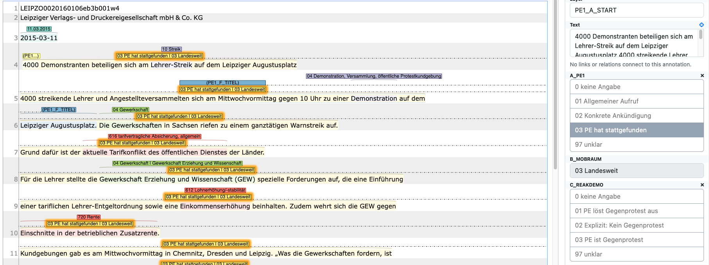

**Source**: <i>This use-case was kindly contributed by Sebastian Haunss, University of Bremen, Germany.</i>

In the BMBF funded project [Protest and Social Cohesion: Comparing Local Conflict Dynamics][1] we are interested in analyzing which actors have addressed which topics in protests in recent years, what form these protests have taken, and how they may affect social cohesion. The focus is on the one hand on recording the breadth of protest activities and on the other hand to analyze in-depth the interactions and relationships among the various protest actors and between protesters and other social actors at the local level.

The project relies an the annotation of articles from local newspapers. Based on a codebook derived from the [Institute for Protest and Social Movement Studies core protest event analysis codebook][2], INCEpTION is used to annotate individual protest events.

After an initial phase of manual coding, we use transformer models to 
1. identify relevant newspaper articles that contain protest events, 
2. identify text spans within articles that contain information about protest events, and 
3. classify text spans in order automate the annotation process as far as possible. 

<figure id="figure1" style="text-align: center">
  
  <figcaption>Sample annotation within one article.</figcaption>
</figure>

##### References
* Daphi, Priska, Sebastian Haunss, Moritz Sommer and Simon Teune. 2021. 
  “Taking to the Streets in Germany – Disenchanted and Confident Critics in Mass Demonstrations”. 
  German Politics (Published online: 07 Dec 2021): 1–29. 
  [[online](https://doi.org/10.1080/09644008.2021.1998459)]
* Wiedemann, Gregor, Jan Matti Dollbaum, Sebastian Haunss, Priska Daphi and Larissa Daria Meier. 2022. 
  A Generalizing Approach to Protest Event Detection in German Local News. Marseille, 
  [[PDF](http://www.lrec-conf.org/proceedings/lrec2022/pdf/2022.lrec-1.413.pdf)].

[1]: https://www.fgz-risc.de/forschung/alle-forschungsprojekte/details/BRE_F_04
[2]: https://protestinstitut.eu/wp-content/uploads/2021/05/ipb-Basiscodebuch-Protestereignisanalyse.pdf
